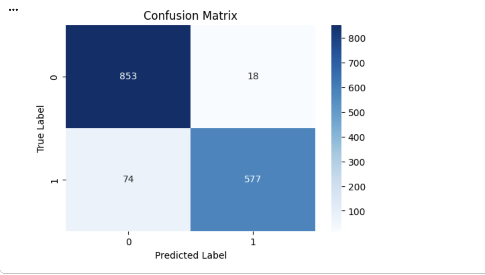

# Disaster-Tweet-Classification-using-Natural-Language-Processing
## Overview

This project focuses on detecting real disaster-related events from social media posts using natural language processing and machine learning techniques. Social media platforms such as Twitter are often the first source of information during emergencies, and being able to automatically distinguish real disaster reports from unrelated content can support faster situational awareness and response.

The project was originally developed as a Google Colab notebook combining explanatory text and executable code. This repository restructures that work into a GitHub-friendly format while preserving the original logic, experiments, and results.

## Motivation

During natural disasters or emergency situations, people frequently post real-time updates on social media. However, not all posts containing keywords like *fire*, *flood*, or *earthquake* refer to actual disasters. The goal of this project is to build a classification model that can automatically identify whether a tweet describes a real disaster event or not.

Such a system could potentially be used as a component in early-warning systems, crisis monitoring tools, or emergency response dashboards.

## Dataset

The project uses a **publicly available Kaggle dataset** containing approximately **10,000 labeled tweets**.

- Target variable: target

  - 1 → Real disaster

  - 0 → Not a disaster

- Input feature:

  - Tweet text (text)

The dataset is commonly used for introductory and intermediate NLP classification tasks and provides a realistic example of noisy, short-form text data.

