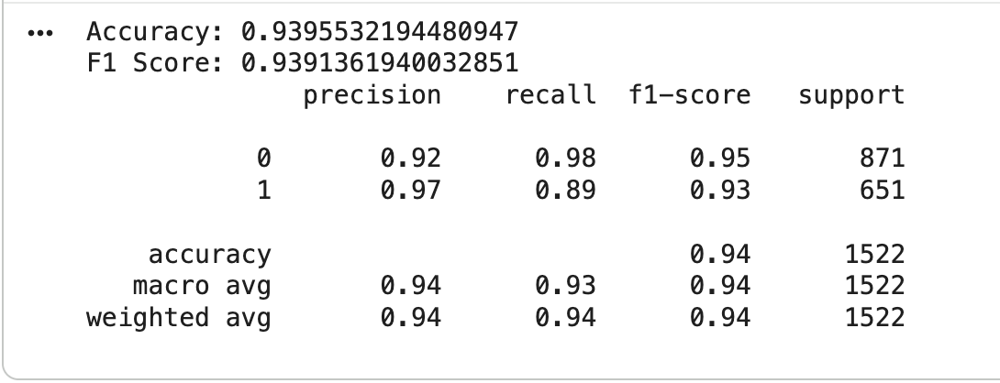

# Disaster-Tweet-Classification-using-Natural-Language-Processing
## Overview

Social media platforms such as Twitter are often the first channels through which people report disaster events, frequently before official news outlets respond. An intelligent system capable of automatically identifying real disaster-related posts can support faster emergency response and potentially save lives.

In this project, we develop a machine learning–based text classification system to determine whether a tweet describes a real disaster or not. The primary objective is **not to miss real disaster events**, making **recall for the disaster class (class 1)** the most critical evaluation metric. Missing a real disaster tweet may have far more serious consequences than generating a false alarm.

## Dataset

The project uses a **“Real or Not? NLP with Disaster Tweets”** containing approximately **10,000 labeled tweets**.

- Target variable: target

  - 1 → Real disaster

  - 0 → Not a disaster

- Input feature:

  - Tweet text (text)

## Methodology

The project follows a step-by-step, experimental approach, gradually increasing model complexity and evaluating each method based on recall performance.

### 1. Classical Machine Learning Baselines

We began with traditional machine learning approaches using:

- TF-IDF vectorization

- Logistic Regression

- Linear Support Vector Classifier (Linear SVC)

Initial recall scores for the disaster class ranged between **0.69** and **0.74**, which was insufficient for the project goal.

Hyperparameter tuning (regularization strength, n-gram ranges) and cross-validation using the **F1-score** were applied, but improvements remained marginal.

## 2. Neural Network Approach

We then tested a **Multi-Layer Perceptron (MLPClassifier)** to evaluate whether a neural model could improve performance. However, this approach did not yield a significant improvement in recall.

## 3. Transformer-Based Models

Next, we explored transformer-based language models.

- **bert-base-uncased** was used to generate contextual embeddings, followed by training classical classifiers on top of these representations.
The results were not satisfactory.

- The decisive improvement came from **BERTweet (vinai/bertweet-base)** — a transformer model **pre-trained specifically on Twitter data**, including hashtags, emojis, and informal language.

The model was **fine-tuned using Hugging Face’s Trainer API**, with attention to training stability (small batch size, early stopping).

## Results

The final BERTweet-based model achieved:

- Recall (Disaster class): 0.886

- Overall F1-score: ~0.94

- Accuracy: ~0.94

These results meet the primary objective of detecting the vast majority of real disaster tweets while maintaining an acceptable error rate.

The full implementation and experiments are documented in the
[Notebook](FINAL_Project_Disaster.ipynb)

## Deployment

The trained model was deployed as a **web application using Gradio**, allowing users to input arbitrary tweets and receive real-time disaster classification predictions.
The application loads the saved model hosted on Hugging Face.

